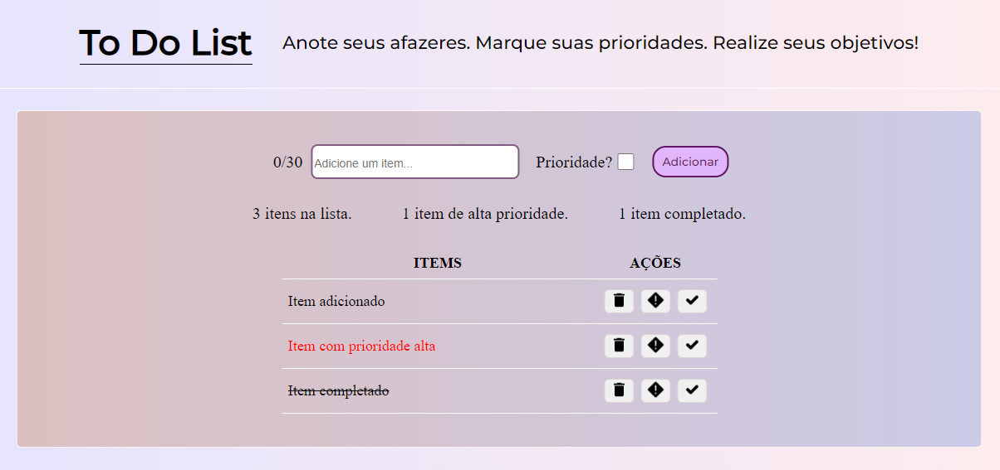

<h1 align="center"> To Do List </h1>

Um simples ToDoList feito com VueJs e Vite. Construído apenas o frontend da aplicação no modelo SPA (Single Page Application).

<h3>Funcionalidades:</h3>
<ul>
  <li>Adicionar itens e prioridades;</li>
  <li>Mudar as prioridades;</li>
  <li>Completar os itens;</li>
  <li>Excluir os itens.</li>
</ul>
 

